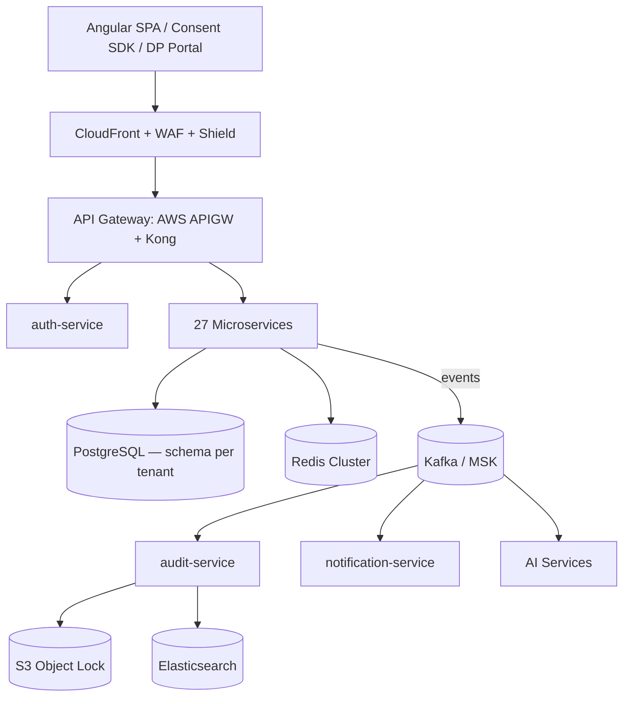

# DataShield India
## Architecture Document

**Document Version:** 1.0 · **Classification:** Confidential — Internal Engineering
**Companion Documents:** SRS v1.0, Software Architecture Document (detailed) v1.0

---

## Table of Contents
1. High-Level Architecture
2. Microservice Boundaries
3. Database Per Service
4. Event Flow
5. API Gateway
6. Authentication
7. Authorization
8. Caching
9. Queue System
10. Notification System
11. Logging
12. Monitoring
13. Disaster Recovery
14. Backup Strategy

---

# 1. High-Level Architecture

DataShield India is a schema-per-tenant, Kubernetes-native, event-driven microservice platform. Traffic flows: **Client → CDN/WAF → API Gateway → Microservice → Data Store**, with all state changes additionally published to Kafka for asynchronous consumers (audit, notification, analytics, AI).

All Class A (PII) data is pinned to `ap-south-1` (Mumbai) with synchronous DR replication to `ap-south-2` (Hyderabad). Tenancy isolation scales with tier: shared namespace + schema-per-tenant (Starter/Professional) up to dedicated cluster + HSM/BYOK (Government).

---

# 2. Microservice Boundaries

27 services across five domains, each owning its data and exposing only versioned APIs/events — no service reads another service's database directly.

| Domain | Services | Boundary Principle |
|---|---|---|
| **Core Compliance** | consent-service, rights-service, breach-service, vendor-service, policy-service, retention-service, grievance-service | One service per DPDP obligation category (§6/7/9, §11–14A, §8, §8(2)) |
| **Data Intelligence** | discovery-service, classification-service, lineage-service | Pipeline stages — discovery feeds classification feeds lineage, each independently scalable |
| **AI Services** | ai-analysis-service, pii-detection-service, risk-scoring-service, anomaly-service | Isolated for independent GPU/CPU scaling and model-versioning lifecycle |
| **Platform** | auth-service, tenant-service, notification-service, workflow-service, audit-service | Cross-cutting concerns consumed by every domain service |
| **Reporting** | analytics-service, report-service | Read-optimized (CQRS) — never on the compliance write path |
| **Integration** | connector-service, webhook-service, siem-service, dpbi-service | Adapters to external systems — isolate third-party instability from core domain logic |
| **Infrastructure** | config-service, search-service | Shared technical utilities |

**Boundary rule:** a service may only be called synchronously (REST) for request/response needs (e.g., rights-service calling auth-service to verify identity); all cross-domain side effects (notify, audit, retain, score risk) happen via Kafka events, never direct synchronous chains across domains.

---

# 3. Database Per Service

Each core service owns a private schema (or, for Enterprise/Government tenants, a fully dedicated database). No cross-service foreign keys exist at the database level — references between services' entities are by ID only, resolved via API calls or event payloads.

| Service | Primary Tables | Store |
|---|---|---|
| consent-service | `consent_records`, `consent_purposes`, `consent_notices` | PostgreSQL (hash-partitioned by tenant_id) |
| rights-service | `dpr_requests`, `dpr_activities`, `dpr_aggregated_data` | PostgreSQL |
| breach-service | `breach_incidents`, `breach_containment_actions`, `breach_remediation_tasks` | PostgreSQL |
| vendor-service | `vendors`, `vendor_dpas`, `vendor_risk_assessments`, `cross_border_transfers` | PostgreSQL |
| policy-service | `policies`, `policy_versions`, `policy_translations` | PostgreSQL |
| retention-service | `retention_policies`, `legal_holds`, `deletion_jobs` | PostgreSQL |
| grievance-service | `grievances`, `grievance_escalations` | PostgreSQL |
| discovery-service | `discovery_scans`, `discovery_findings` | PostgreSQL |
| classification-service | `pii_classifications`, `false_positive_overrides` | PostgreSQL |
| lineage-service | `data_flows`, `dpar_records` | PostgreSQL |
| risk-scoring-service | `risk_scores` | PostgreSQL |
| anomaly-service | `anomaly_alerts` | Elasticsearch (write-optimized for stream ingestion) |
| auth-service | `users`, `sessions`, `mfa_devices`, `refresh_tokens` | PostgreSQL + Redis (sessions) |
| tenant-service | `tenants`, `feature_flags` | PostgreSQL |
| audit-service | `audit_events` (canonical) | S3 Object Lock (WORM) + Elasticsearch (searchable copy) |
| analytics-service | Materialized rollups | Elasticsearch |
| report-service | `report_jobs` (metadata only; output in S3) | PostgreSQL + S3 |

**Rationale:** PostgreSQL for transactional, relationally-rich domains (consent, rights, breach, vendor); Elasticsearch where write-throughput and full-text/aggregation query patterns dominate (audit search, anomaly alerts, analytics rollups); S3 Object Lock as the canonical immutable store for anything with regulatory retention obligations.

---

# 4. Event Flow

Kafka (Amazon MSK, 6 brokers, Avro schemas via Schema Registry) is the backbone for all cross-domain side effects. Pattern: **Outbox + CDC (Debezium)** — a service writes its DB change and an outbox row in the same local transaction; Debezium tails the outbox and publishes to Kafka, guaranteeing at-least-once delivery without distributed transactions.

| Topic | Producer | Key Consumers |
|---|---|---|
| `consent.granted` / `consent.withdrawn` / `consent.expired` | consent-service | notification-service, audit-service, analytics-service, ai-analysis-service |
| `dpr.request.submitted` / `dpr.erasure.initiated` / `dpr.erasure.completed` | rights-service | notification-service, audit-service, retention-service, connected systems (Saga participants) |
| `breach.incident.created` / `breach.dpbi.notified` | breach-service | notification-service, audit-service, dpbi-service |
| `ai.pii.detected` / `ai.risk.scored` | pii-detection-service, risk-scoring-service | analytics-service, classification-service |
| `audit.event.created` | all services (via Outbox) | audit-service (sole consumer of the raw firehose) |
| `notification.send` | notification-service internal | channel adapters (SES, Gupshup, FCM/APNs) |

**Saga example — Erasure (DPR §13):** `rights-service` publishes `dpr.erasure.initiated`; each of 30+ connected systems consumes and publishes `dpr.erasure.ack`/`failed`; the orchestrator (Temporal.io-backed, 48-hour timeout) waits for all acks, then publishes `dpr.erasure.completed`. Partial failures are logged per-system in the erasure certificate rather than rolling back successful deletions.

---

# 5. API Gateway

**Stack:** AWS API Gateway (edge termination, WAF integration) → Kong Enterprise (internal routing, plugin chain).

**Responsibilities:** JWT validation (tenant + user claims + scope), per-tenant rate limiting (Starter 100/min → Enterprise 10,000/min), circuit breaking per upstream service, request/response transformation, and centralized API versioning (`/v1/`, `/v2/` URI-based).

**Routing:** Tenant resolved via subdomain, `X-Tenant-ID` header, or JWT claim → Redis-cached tenant registry lookup (5-min TTL) → request routed to the correct Kubernetes namespace/schema.

---

# 6. Authentication

OAuth2 + JWT (RS256, 1-hour access token expiry). Four flows: **Client Credentials** (B2B service accounts), **Password + MFA** (DPO/Admin portal), **OTP-based** (Data Principal Rights Portal), **SSO/SAML 2.0/OIDC** (Enterprise tier — Okta, Azure AD, Google Workspace). Refresh tokens are opaque, hashed at rest, and rotated on every use; reuse of a rotated token triggers full session-family revocation (theft signal).

---

# 7. Authorization

**RBAC** (10 platform roles, `SUPER_ADMIN` → `DATA_PRINCIPAL`) enforced coarsely at the Kong Gateway and re-validated at the service layer. **ABAC** via OPA (Open Policy Agent) sidecar handles attribute-level rules the role hierarchy can't express alone — tenant ownership checks, legal-hold deny rules, and "Data Principal may read only their own records" — evaluated as policy-as-code (Rego), not hardcoded conditionals scattered across services.

---

# 8. Caching

Redis Cluster (6 shards, ElastiCache) is the shared cache layer. Patterns by use case:

| Pattern | Used For | TTL |
|---|---|---|
| Cache-aside | Consent notices, DPR request status, compliance score | 5 min – 1 hour |
| Write-through | Tenant registry, active sessions, feature flags | 5–30 min |
| Atomic INCR + TTL | Rate-limit counters | 1 min |

Key namespace: `{tenant_id}:{service}:{entity}:{id}`. CDN (CloudFront) caches static, India-only-origin assets (consent widget JS/CSS) as a second cache layer ahead of Redis.

---

# 9. Queue System

Kafka (MSK) is the sole queue/event backbone — no secondary message broker. Topics are partitioned for parallelism (10–60 partitions depending on volume) with replication factor 3 / min ISR 2. Every topic has a Dead Letter Queue; poison messages are quarantined after 3 failed consumer attempts for manual review rather than blocking the partition indefinitely.

---

# 10. Notification System

notification-service consumes from the `notification-consumer-group` (subscribing to `consent.*`, `dpr.*`, `breach.*`) and fans out across channels: Email (AWS SES, ap-south-1), SMS/WhatsApp (MSG91/Gupshup), Push (FCM/APNs), In-app (WebSocket + Redis Pub/Sub), and outbound Webhooks (signed HMAC, exponential backoff, DLQ after 10 attempts). Templates are rendered in the recipient's preferred language from the 22-language catalogue before dispatch.

---

# 11. Logging

Structured JSON logging (Logback + logstash-logback-encoder) shipped to the ELK stack. Every log line carries `traceId`, `spanId`, and `tenantId` for cross-service correlation. ERROR/WARN are always-on; INFO/DEBUG are toggled per-service via feature flag for targeted troubleshooting without a redeploy. Audit-relevant logs are additionally hash-chained and written to S3 Object Lock — operational logs (1-year retention) and audit logs (5–10 years per data type) live in separate Elasticsearch clusters with different access controls.

---

# 12. Monitoring

**Metrics:** Prometheus + Grafana, 15 pre-built dashboards (compliance KPIs, infra health, business metrics). **Tracing:** Jaeger + OpenTelemetry auto-instrumentation, `traceId` propagated through HTTP and Kafka headers. **Alerting:** Prometheus AlertManager → PagerDuty (P0/P1) + Slack, thresholds tied to SLO error-budget burn rate. **Synthetic monitoring** hits critical user journeys (login, consent collection, DSAR submission) every minute from outside the cluster to catch issues before real users do.

---

# 13. Disaster Recovery

Active-passive multi-region: `ap-south-1` (Mumbai, primary) ↔ `ap-south-2` (Hyderabad, standby). Synchronous PostgreSQL replication for Class A data; Kafka MirrorMaker2 replicates non-PII topics only (data-localization compliance prevents cross-region PII event replication). Route53 health-check-based failover targets **RTO < 15 minutes, RPO < 5 minutes**, validated via a full failover drill every quarter (trigger failover → validate functionality → measure actual RTO/RPO → fail back → document gaps).

---

# 14. Backup Strategy

| Asset | Frequency | Retention |
|---|---|---|
| RDS PostgreSQL | Continuous PITR + nightly snapshot | 35 days PITR, 1 year snapshot archive |
| S3 audit logs | Continuous (Object Lock WORM) | 7–10 years by data-type retention class |
| Elasticsearch | Daily snapshot to S3 | 90 days |
| Kafka (MSK) | Per-topic retention config | 30 days – 10 years by topic |
| Configuration (Git) | Every commit | Indefinite |

Restores are always performed onto a new instance (never in-place onto production), validated via row-count reconciliation and audit hash-chain spot-checks before cutover.

---

*End of Document — DataShield India Architecture Document v1.0*
