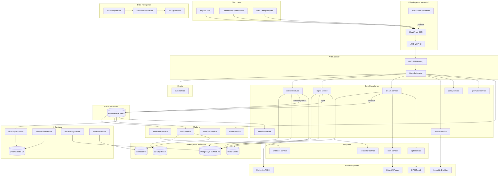
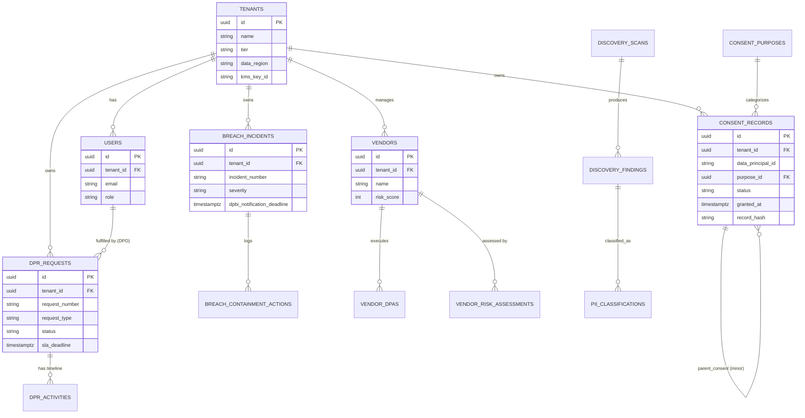
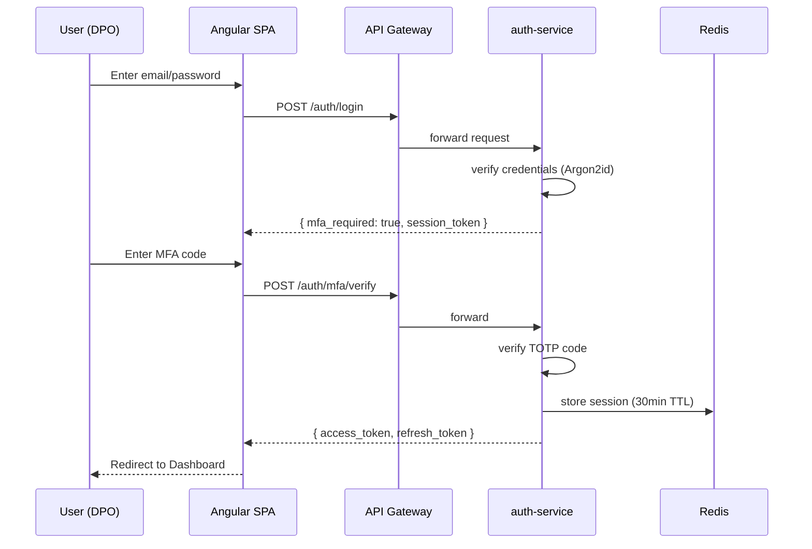
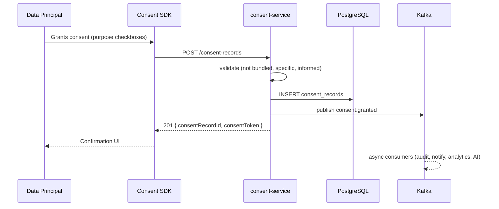
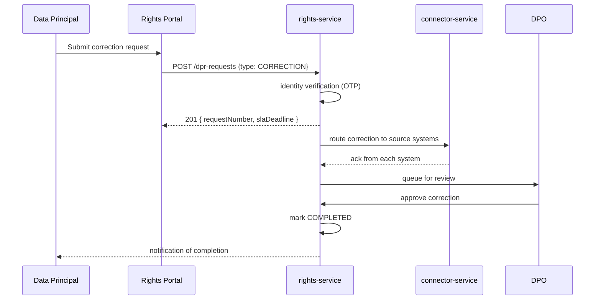
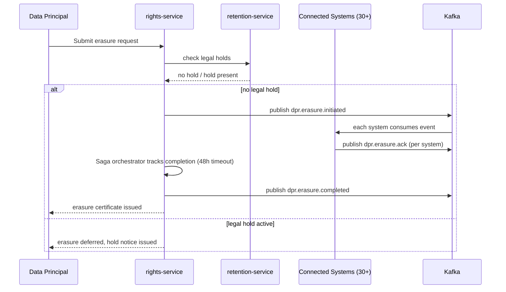
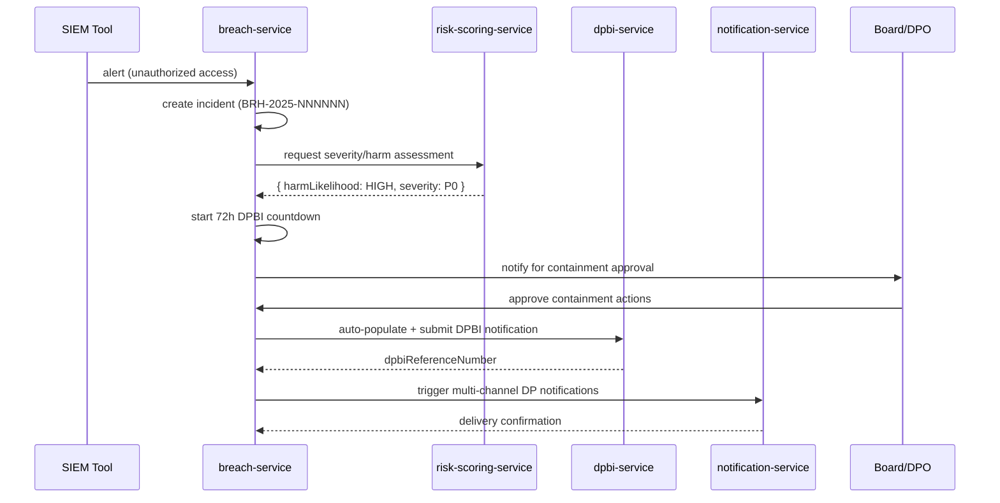
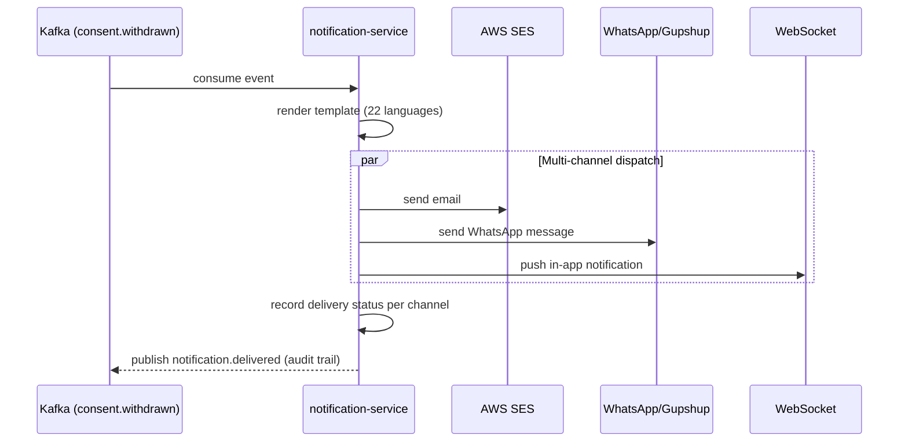
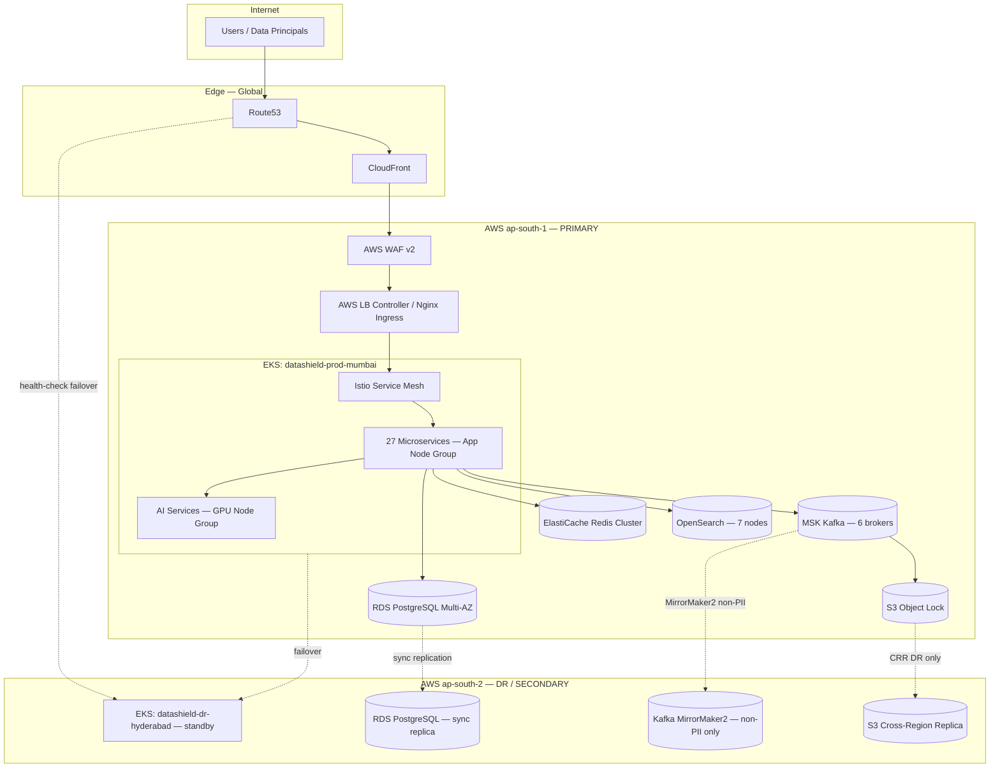

# DataShield India
## Software Architecture Document · API Documentation · Standard Operating Procedures

**Document Version:** 1.0 · **Classification:** Confidential — Internal Engineering
**Companion Document:** DataShield India Enterprise PRD v1.0

---

## Table of Contents

1. Executive Summary
2. Functional Requirements
3. Non-Functional Requirements
4. High-Level Architecture
5. Low-Level Design
6. Database Design
7. API Documentation
8. Authentication & Authorization
9. Security Design
10. Sequence Diagrams
11. Deployment Architecture
12. Standard Operating Procedures (SOP)
13. API Versioning Strategy
14. Scaling Strategy
15. Folder Structure
16. Best Practices

---

# 1. Executive Summary

## 1.1 Purpose
This document is the engineering reference for building, operating, and maintaining **DataShield India**, an AI-powered, multi-tenant SaaS platform for DPDP Act, 2023 compliance. It translates the product requirements defined in the PRD into an implementable architecture: service boundaries, data models, APIs, security controls, deployment topology, and the operational procedures a senior engineering team needs to run the system in production.

## 1.2 Scope
Covers backend microservices (Java 21 / Spring Boot 3.x), frontend (Angular 17), data layer (PostgreSQL 15, Redis 7, Elasticsearch, Kafka/MSK), AI subsystem (RAG + ML), Kubernetes deployment on AWS (ap-south-1 / ap-south-2), and the operational SOPs covering development, deployment, incident management, DB migration, monitoring, and backup/recovery. Out of scope: detailed UI/UX wireframes, sales/marketing systems, and billing/finance subsystems (covered only at integration-point level).

## 1.3 Objectives
- Deliver 100% functional coverage of DPDP Act §4–§20 obligations via discrete, testable services.
- Achieve 99.99% platform SLA (99.999% for the consent-collection critical path).
- Guarantee India data residency for all Class A (PII) data with zero cross-border transfer.
- Support 500M+ data principals, 10,000+ concurrent tenants, 100K consent TPS at peak.
- Provide an audit-proof, hash-chained, immutable evidence trail for every compliance-relevant action.
- Ship a platform a 12–15 engineer squad can build, operate, and extend without architectural rewrites through Year 3 scale.

## 1.4 High-Level Overview
DataShield India is built as a **schema-per-tenant, Kubernetes-native, event-driven microservice platform**. Client traffic enters through an edge layer (CloudFront → WAF → API Gateway), is authenticated via OAuth2/JWT, and routed to one of 27 core microservices grouped into five domains: **Core Compliance**, **Data Intelligence**, **AI Services**, **Platform**, and **Integration**. State changes are captured as Kafka events (Outbox + CDC via Debezium), consumed asynchronously for notification, audit, analytics, and AI triggers. All Class A data lives exclusively in `ap-south-1` (Mumbai) with synchronous DR replication to `ap-south-2` (Hyderabad).

---

# 2. Functional Requirements

Functional requirements are organized by the same module boundaries defined in the PRD's Core Modules section. Each FR maps to one or more services in Section 5.

## 2.1 Consent Management (CME)

| FR-ID | Requirement | Priority | Owning Service |
|---|---|---|---|
| FR-CM-001 | Collect granular consent per processing purpose | P0 | consent-service |
| FR-CM-002 | Consent must be freely given, specific, informed, unambiguous | P0 | consent-service |
| FR-CM-003 | Record timestamp, IP, device info per consent event | P0 | consent-service, audit-service |
| FR-CM-004 | Withdrawal as easy as granting | P0 | consent-service |
| FR-CM-005 | 22 Indian language consent notices | P1 | policy-service |
| FR-CM-006 | Age verification for minors (<18) | P0 | consent-service |
| FR-CM-007 | Parental/guardian consent verification workflow | P0 | consent-service, workflow-service |
| FR-CM-008 | Consent version management — re-consent on policy change | P0 | consent-service, policy-service |
| FR-CM-009 | Programmatic Consent API | P0 | consent-service |
| FR-CM-010 | Offline OCR consent capture | P1 | connector-service |
| FR-CM-011 | Consent bundling detection/prevention | P0 | consent-service |
| FR-CM-012 | Deemed consent (§7) tracking | P1 | consent-service |

## 2.2 Data Principal Rights (DPRE)

| FR-ID | Requirement | Priority | Owning Service |
|---|---|---|---|
| FR-DPR-001 | Omni-channel rights intake (web/mobile/email/WhatsApp) | P0 | rights-service, notification-service |
| FR-DPR-002 | Identity verification before fulfillment | P0 | auth-service, rights-service |
| FR-DPR-003 | SLA countdown per request | P0 | rights-service, workflow-service |
| FR-DPR-004 | Automated multi-system data aggregation | P0 | rights-service, connector-service |
| FR-DPR-005 | Structured export (JSON/PDF/CSV) | P0 | rights-service, report-service |
| FR-DPR-006 | Multi-system deletion orchestration (Saga) | P0 | rights-service, retention-service |
| FR-DPR-007 | Legal hold override on erasure | P0 | retention-service |
| FR-DPR-008 | Erasure certificate issuance | P1 | rights-service, report-service |
| FR-DPR-009 | Nomination registration | P1 | rights-service |
| FR-DPR-010 | Grievance → DPBI escalation pathway | P0 | grievance-service, dpbi-service |
| FR-DPR-011 | Request status tracking dashboard | P0 | rights-service, analytics-service |
| FR-DPR-012 | Bulk/class-action request handling | P1 | rights-service |

## 2.3 Breach Notification (BNS)

| FR-ID | Requirement | Priority | Owning Service |
|---|---|---|---|
| FR-BN-001 | Incident creation — manual + SIEM | P0 | breach-service, siem-service |
| FR-BN-002 | Automated severity classification | P0 | breach-service, risk-scoring-service |
| FR-BN-003 | 72-hr DPBI SLA countdown | P0 | breach-service, dpbi-service |
| FR-BN-004 | DPBI form auto-generation | P0 | dpbi-service, report-service |
| FR-BN-005 | Multi-channel DP notification | P0 | notification-service |
| FR-BN-006 | Containment action logging | P0 | breach-service, audit-service |
| FR-BN-007 | Post-breach remediation tracking | P1 | breach-service, workflow-service |
| FR-BN-008 | Breach impact assessment workflow | P0 | breach-service, risk-scoring-service |
| FR-BN-009 | Regulatory correspondence archive | P0 | dpbi-service |
| FR-BN-010 | SIEM integration (Splunk/QRadar/Sentinel) | P1 | siem-service |

## 2.4 Data Discovery & Classification

| FR-ID | Requirement | Priority | Owning Service |
|---|---|---|---|
| FR-DD-001 | Scan relational DBs (PostgreSQL/MySQL/Oracle/MSSQL) | P0 | discovery-service |
| FR-DD-002 | Scan NoSQL (MongoDB/DynamoDB/Cassandra) | P0 | discovery-service |
| FR-DD-003 | Scan file systems/object storage (S3/GCS/SFTP) | P0 | discovery-service |
| FR-DD-004 | Scan API payloads for PII | P1 | pii-detection-service |
| FR-DD-005 | Classify per DPDP Schedule §2(t) | P0 | classification-service |
| FR-DD-006 | Auto-generate DPAR | P0 | lineage-service |
| FR-DD-007 | Scheduled + on-demand scans | P0 | discovery-service, workflow-service |
| FR-DD-008 | Confidence scoring + false-positive mgmt | P0 | classification-service |
| FR-DD-009 | Data flow visualization | P0 | lineage-service |

## 2.5 Vendor Risk, Audit & Policy (supporting modules)
FR-VR-001..006 (vendor onboarding, DPA lifecycle, AI risk scoring, cross-border tracking) → `vendor-service`.
FR-AU-001..004 (immutable logs, hash chaining, board reporting, evidence repository) → `audit-service`, `report-service`.
FR-PM-001..003 (policy versioning, AI gap analysis, notice builder) → `policy-service`, `ai-analysis-service`.

---

# 3. Non-Functional Requirements

## 3.1 Performance
| Target | Value |
|---|---|
| API p95 latency | < 200ms |
| API p99 latency | < 500ms |
| Dashboard load | < 2s |
| Consent widget load | < 100ms |
| Consent throughput (peak) | 100,000 TPS |
| Discovery scan throughput | 1M records/hour |
| Bulk DPR export (<1M records) | < 5 min |

## 3.2 Scalability
500M+ data principals · 10,000+ concurrent tenants · 10B+ consent records · 1B+ audit events/day · horizontal auto-scale-out < 60s · unlimited tiered S3 storage.

## 3.3 Availability
| Service | SLA | Error Budget (30d) |
|---|---|---|
| Consent Collection API | 99.999% | 26 sec/month |
| API Gateway (overall) | 99.99% | 4.3 min/month |
| DPR Portal | 99.95% | 21.9 min/month |
| Dashboard/Reporting | 99.9% | 43.8 min/month |
| AI Analysis Service | 99.5% | 3.6 hr/month |

RTO < 15 min · RPO < 5 min · multi-region failover < 3 min.

## 3.4 Security
AES-256 at rest, TLS 1.3 in transit, per-tenant cryptographic isolation, HSM-backed keys (AWS CloudHSM, FIPS 140-2 L3), 90-day key rotation, OWASP ASVS Level 2 application baseline, zero-trust network model (no implicit VPC trust).

## 3.5 Maintainability
>80% unit test coverage gate in CI, SonarQube quality gate, contract testing (Pact) between services, OpenAPI-first service contracts, ADRs (Architecture Decision Records) for every cross-cutting change, max cyclomatic complexity 10 per method (Checkstyle/PMD enforced).

## 3.6 Reliability
Circuit breakers (Resilience4j) on every outbound call, DLQ per Kafka topic (3-retry quarantine), Saga pattern for distributed transactions (erasure across 30+ systems), idempotency keys mandatory on all write APIs.

## 3.7 Disaster Recovery
Active-passive multi-region (Mumbai primary / Hyderabad standby). Synchronous PostgreSQL replication for Class A data. DR drills quarterly. Full platform restore tested against RTO/RPO targets every quarter; results logged in the DR runbook (Section 12.6).

---

# 4. High-Level Architecture

## 4.1 Component Overview

| Layer | Components |
|---|---|
| **Client** | Angular 17 SPA (DPO/Admin), Consent Web SDK (JS), Mobile SDK (Android/iOS), Data Principal Portal |
| **Edge** | CloudFront (India POPs), AWS WAF v2, AWS Shield Advanced, Route53 (health-check failover) |
| **API Gateway** | AWS API Gateway (edge) + Kong Enterprise (internal routing, plugins, rate limiting) |
| **Auth** | auth-service — OAuth2/OIDC, JWT issuance, MFA, session mgmt |
| **Core Compliance Services** | consent-service, rights-service, breach-service, vendor-service, policy-service, retention-service, grievance-service |
| **Data Intelligence** | discovery-service, classification-service, lineage-service |
| **AI Services** | ai-analysis-service, pii-detection-service, risk-scoring-service, anomaly-service |
| **Platform Services** | tenant-service, notification-service, workflow-service, audit-service |
| **Reporting** | analytics-service, report-service |
| **Integration** | connector-service, webhook-service, siem-service, dpbi-service |
| **Infrastructure** | config-service, search-service |
| **Data Stores** | PostgreSQL 15 (RDS Multi-AZ), Redis 7 (ElastiCache cluster), Elasticsearch/OpenSearch, S3 (Object Lock) |
| **Messaging** | Amazon MSK (Kafka 3.6), Schema Registry (Avro) |
| **External Integrations** | DigiLocker, UIDAI, Razorpay, Finacle/Temenos, Leegality/DigiSign, MSG91/Gupshup, AWS SES, FCM/APNs, Splunk/QRadar/Sentinel |

## 4.2 Mermaid — System Architecture



## 4.3 Tenancy Model
Silo model with shared infrastructure, varying isolation by tier (Starter/Professional: shared K8s namespace + schema-per-tenant; Enterprise: dedicated namespace + DB-per-tenant; Government: dedicated cluster + HSM/BYOK). Tenant resolution: subdomain or `X-Tenant-ID` header or JWT claim → Redis-cached registry lookup (5-min TTL) → namespace/schema/KMS-key routing.


---

# 5. Low-Level Design

Standard service template: **Responsibility → Internal Modules → DB Interaction → Cache Usage → Events → Failure Handling**. All services are Spring Boot 3.x, expose Actuator health/readiness probes, and run behind Istio sidecars (mTLS).

## 5.1 Core Compliance Domain

### consent-service
- **Responsibility:** Full consent lifecycle — collection, validation (freely-given/specific/informed/unambiguous), withdrawal, versioning, deemed-consent tracking.
- **Internal Modules:** `ConsentCollectionController`, `ConsentValidationEngine` (bundling detection), `ConsentTokenIssuer` (JWT consent claims), `MinorConsentOrchestrator`, `ConsentRepository`.
- **DB Interaction:** Writes/reads `consent_records` (hash-partitioned by `tenant_id`), `consent_purposes`, `consent_notices`. Uses optimistic locking on withdrawal to prevent double-processing.
- **Cache Usage:** Redis cache-aside for rendered consent notices (`{tenant}:consent:notice:{lang}:{v}`, TTL 1h); DP active-consent summary cached 5 min.
- **Events Published:** `consent.granted`, `consent.withdrawn`, `consent.expired` (Avro, Outbox pattern via Debezium CDC).
- **Events Consumed:** `policy.version.changed` (triggers re-consent flow).
- **Failure Handling:** Idempotent writes via `X-Correlation-ID`; on Kafka publish failure, Outbox table retried by polling publisher every 5s with exponential backoff; circuit breaker (Resilience4j) on DigiLocker age-verification calls, falls back to manual DOB capture.

### rights-service
- **Responsibility:** DSAR orchestration — access, correction, erasure, nomination, status tracking.
- **Internal Modules:** `RequestIntakeController`, `IdentityVerificationAdapter`, `AggregationOrchestrator` (Saga coordinator), `ResponseGenerator`, `SlaTracker`.
- **DB Interaction:** `dpr_requests`, `dpr_activities` (append-only timeline), `dpr_aggregated_data` (transient, encrypted, TTL-purged post-delivery).
- **Cache Usage:** Request status cached 5 min (`{tenant}:dpr:{requestNumber}`); SLA deadline computation cached per request.
- **Events Published:** `dpr.request.submitted`, `dpr.erasure.initiated`, `dpr.erasure.completed`.
- **Events Consumed:** `dpr.erasure.ack` / `dpr.erasure.failed` from each connected system (Saga participants).
- **Failure Handling:** Saga orchestrator with 48-hour timeout; partial-failure compensation logs failed system + alerts DPO for manual intervention; legal-hold check is a synchronous pre-condition before every deletion step.

### breach-service
- **Responsibility:** Incident lifecycle, severity classification, containment logging, remediation tracking.
- **Internal Modules:** `IncidentController`, `SeverityClassifier` (rules + AI call to risk-scoring-service), `ContainmentLogger`, `RemediationTracker`.
- **DB Interaction:** `breach_incidents`, `breach_containment_actions`, `breach_remediation_tasks`.
- **Cache Usage:** 72-hour countdown timer state cached in Redis with TTL-based expiry alerts (KEDA-scaled consumer polls expiring keys).
- **Events Published:** `breach.incident.created`, `breach.dpbi.notified`, `breach.remediation.completed`.
- **Events Consumed:** `siem.alert.raised` (from siem-service).
- **Failure Handling:** DPBI submission wrapped in retry-with-backoff (max 5 attempts); on terminal failure, P0 PagerDuty alert to DPO + Legal; manual fallback submission path documented in SOP 12.3.

### vendor-service
- **Responsibility:** Data processor registry, DPA lifecycle, sub-processor tracking, risk assessment.
- **Internal Modules:** `VendorOnboardingController`, `DpaLifecycleManager`, `RiskAssessmentEngine` (calls risk-scoring-service), `CrossBorderTransferTracker`.
- **DB Interaction:** `vendors`, `vendor_dpas`, `vendor_risk_assessments`, `cross_border_transfers`.
- **Cache Usage:** Vendor risk score cached 1h.
- **Events Published:** `vendor.onboarded`, `vendor.dpa.signed`, `vendor.risk.updated`.
- **Failure Handling:** E-signature webhook (Leegality) processed idempotently keyed on document ID; reconciliation job nightly cross-checks DPA status against provider API.

### policy-service
- **Responsibility:** Privacy policy version control, gap analysis orchestration, multi-language notice generation.
- **Internal Modules:** `PolicyRepository`, `ChangeImpactAnalyzer`, `NoticeBuilder`, `AiGapAnalysisAdapter` (calls ai-analysis-service).
- **DB Interaction:** `policies`, `policy_versions`, `policy_translations`.
- **Cache Usage:** Active policy version cached per tenant (15 min).
- **Events Published:** `policy.version.changed`, `policy.gap.analysis.completed`.
- **Failure Handling:** AI gap-analysis calls have 10s timeout with graceful degradation to "manual review required" status rather than blocking publish.

### retention-service
- **Responsibility:** Retention schedule enforcement, legal hold management, deletion orchestration triggers.
- **Internal Modules:** `RetentionScheduler` (Airflow-triggered), `LegalHoldManager`, `DeletionDispatcher`.
- **DB Interaction:** `retention_policies`, `legal_holds`, `deletion_jobs`.
- **Events Consumed:** `consent.withdrawn`, `dpr.erasure.completed` (drives downstream purge scheduling).
- **Failure Handling:** Legal hold takes precedence — deletion jobs check `legal_holds` table synchronously before execution; conflicts raise `retention.conflict.flagged` event to notify DPO.

### grievance-service
- **Responsibility:** Grievance intake, routing, DPBI escalation, resolution tracking.
- **Internal Modules:** `GrievanceIntakeController`, `EscalationRouter`, `ResolutionTracker`.
- **DB Interaction:** `grievances`, `grievance_escalations`.
- **Events Published:** `grievance.filed`, `grievance.escalated.dpbi`.
- **Failure Handling:** SLA breach (30-day) auto-triggers DPBI escalation pathway via dpbi-service; manual override requires DPO + Legal dual-approval (4-eyes principle).

## 5.2 Data Intelligence Domain

### discovery-service
- **Responsibility:** PII discovery scanning across DBs, file systems, object storage.
- **Internal Modules:** `DbScannerAdapter` (PostgreSQL/MySQL/Oracle/MSSQL/Mongo/Dynamo/Cassandra), `FileSystemScanner` (S3/GCS/SFTP), `ScanScheduler`.
- **DB Interaction:** `discovery_scans`, `discovery_findings` (raw, pre-classification).
- **Events Published:** `discovery.scan.completed`, `discovery.finding.raised` → consumed by classification-service.
- **Failure Handling:** Scans run as Kubernetes Jobs with checkpointing; partial-scan resume on pod eviction; throttled via token bucket to avoid overloading source systems (configurable QPS cap per connector).

### classification-service
- **Responsibility:** PII entity classification against DPDP Schedule, confidence scoring.
- **Internal Modules:** `ClassificationEngine` (calls pii-detection-service), `ConfidenceScorer`, `FalsePositiveManager`.
- **DB Interaction:** `pii_classifications`, `false_positive_overrides`.
- **Events Published:** `classification.completed` → lineage-service.
- **Failure Handling:** Confidence < 0.85 routed to human review queue rather than auto-classified.

### lineage-service
- **Responsibility:** Data flow mapping, DPAR auto-generation.
- **Internal Modules:** `LineageGraphBuilder`, `DparGenerator`, `FlowDiagramExporter`.
- **DB Interaction:** `data_flows`, `dpar_records` (graph stored as adjacency table + materialized view for export).
- **Failure Handling:** DPAR generation is idempotent and re-runnable; partial graph data still produces a "draft" DPAR flagged for completion.

## 5.3 AI Services Domain

### ai-analysis-service
- **Responsibility:** LLM-powered policy gap analysis, consent notice generation, legal summarization (LangChain/LangGraph orchestration over RAG).
- **Internal Modules:** `RagRetriever` (Qdrant), `PromptLibraryManager` (200+ DPDP prompts), `GuardrailValidator` (citation hallucination check), `HumanReviewGate`.
- **DB Interaction:** Reads `policies`; writes `ai_analysis_results`.
- **Cache Usage:** Embedding cache for repeated policy chunks (24h TTL).
- **Events Published:** `ai.policy.gap.analyzed`.
- **Failure Handling:** All outputs with confidence < 0.85 or any legal-citation mismatch are routed to mandatory DPO review before any downstream action; LLM API timeout (10s) falls back to "analysis pending" state.

### pii-detection-service
- **Responsibility:** Real-time PII detection in API payloads and data streams (50+ entity types, Indian formats).
- **Internal Modules:** `NerInferenceClient` (fine-tuned Llama-3-8B), `RedisCacheLayer`, `KafkaPublisher`.
- **Cache Usage:** SHA-256(text) → result cache, 5-min TTL (avoids re-inferencing identical payloads).
- **Events Published:** `ai.pii.detected` (only for high-confidence findings).
- **Failure Handling:** GPU inference circuit breaker; on model unavailability, falls back to regex-based detector for high-precision entity types (Aadhaar, PAN, email) with reduced recall, flagged as `degraded_mode: true`.

### risk-scoring-service
- **Responsibility:** Composite compliance risk scoring (XGBoost/LightGBM ensemble) — tenant, vendor, breach impact.
- **Internal Modules:** `FeatureAggregator`, `ScoringEngine`, `ExplanationGenerator` (plain-English rationale).
- **DB Interaction:** Reads aggregated signals from consent/breach/vendor schemas; writes `risk_scores`.
- **Cache Usage:** Tenant compliance score cached 1h.
- **Events Published:** `ai.risk.scored`.
- **Failure Handling:** Nightly batch scoring as fallback if real-time scoring service degraded; stale-score flag surfaced on dashboard beyond 24h staleness.

### anomaly-service
- **Responsibility:** Data access anomaly detection (Isolation Forest + LSTM) on audit event stream.
- **Internal Modules:** `StreamConsumer` (Kafka), `AnomalyModelRunner`, `AlertDispatcher`.
- **DB Interaction:** Reads from `audit.event.created` stream; writes `anomaly_alerts` to Elasticsearch.
- **Failure Handling:** Model inference failures logged but non-blocking (anomaly detection is advisory, never blocks the underlying audited action).

## 5.4 Platform Domain

### auth-service
- **Responsibility:** Authentication, JWT issuance, OAuth2/OIDC, MFA, session management.
- **Internal Modules:** `TokenIssuer`, `MfaVerifier`, `SessionManager`, `RefreshTokenRotator`.
- **DB Interaction:** `users`, `sessions`, `mfa_devices`, `refresh_tokens` (hashed, rotated).
- **Cache Usage:** Active session cached in Redis (`{tenant}:user:session:{id}`, 30 min sliding TTL).
- **Failure Handling:** Refresh token reuse detection triggers full session family revocation (token theft mitigation).

### tenant-service
- **Responsibility:** Multi-tenancy provisioning, routing, feature flags.
- **Internal Modules:** `TenantProvisioner`, `TenantRegistry`, `FeatureFlagManager`.
- **Cache Usage:** Tenant registry write-through cached (`platform:tenant:registry:{id}`, 5 min).
- **Failure Handling:** Provisioning is a Temporal.io durable workflow — survives pod restarts mid-provisioning.

### notification-service
- **Responsibility:** Multi-channel dispatch — email/SMS/WhatsApp/push/in-app/webhook.
- **Internal Modules:** `ChannelRouter`, `TemplateRenderer` (22-language), `DeliveryTracker`.
- **Events Consumed:** `consent.*`, `dpr.*`, `breach.*` (notification-consumer-group).
- **Failure Handling:** Per-channel circuit breaker; failed sends retried 3× then routed to DLQ for manual resend via admin console.

### workflow-service
- **Responsibility:** BPMN 2.0 workflow engine, SLA-aware task routing.
- **Internal Modules:** `BpmnEngine` (Temporal.io for durable orchestration, Airflow for scheduled jobs), `EscalationRulesEngine`.
- **Failure Handling:** Temporal's built-in durable execution handles worker crashes; in-flight workflows resume from last completed activity.

### audit-service
- **Responsibility:** Immutable audit log ingestion, hash chaining, integrity verification.
- **Internal Modules:** `EventIngestor` (audit-consumer-group, 60+ topics), `HashChainBuilder`, `IntegrityVerifier` (daily job).
- **DB Interaction:** Append-only writes to S3 (Object Lock/WORM) + searchable copy in Elasticsearch.
- **Failure Handling:** Ingestion lag alerting at >30s; any hash-chain mismatch on daily verification triggers P1 security incident.

## 5.5 Reporting Domain

### analytics-service
- **Responsibility:** Real-time aggregation, dashboard metrics, compliance score rollups.
- **Internal Modules:** `MetricsAggregator`, `DashboardQueryService`.
- **Failure Handling:** CQRS read path — degraded analytics never blocks write-path compliance operations.

### report-service
- **Responsibility:** PDF/Excel report generation, regulatory templates, board packs.
- **Internal Modules:** `ReportRenderer`, `RegulatoryTemplateEngine`, `ScheduledReportDispatcher`.
- **Failure Handling:** Long-running report jobs run async via Kubernetes Jobs; status polled by client, results delivered via signed S3 URL (72h expiry).

## 5.6 Integration Domain

### connector-service
- **Responsibility:** 30+ pre-built data source connectors, connection health monitoring.
- **Failure Handling:** Per-connector health check every 60s; unhealthy connectors auto-paused with DPO alert rather than silently failing aggregation requests.

### webhook-service
- **Responsibility:** Outbound webhook delivery, retry logic.
- **Failure Handling:** Exponential backoff (1m → 1h cap), signed payloads (HMAC), DLQ after 10 failed attempts.

### siem-service
- **Responsibility:** SIEM integration (Splunk/QRadar/Sentinel) for breach detection triggers.
- **Failure Handling:** Bidirectional health-check; loss of SIEM connectivity raises platform-level alert (breach detection coverage gap).

### dpbi-service
- **Responsibility:** DPBI portal submission API integration, notification tracking.
- **Failure Handling:** Submission failures escalate via PagerDuty within 1 hour of any 72-hour SLA window remaining — manual portal upload SOP documented as fallback.

## 5.7 Infrastructure Domain

### config-service
- **Responsibility:** Centralized configuration (Spring Cloud Config), backed by Git.
- **Failure Handling:** Services cache last-known-good config locally; config-service outage does not crash dependent services.

### search-service
- **Responsibility:** Elasticsearch proxy with tenant-scoped routing and query optimization.
- **Failure Handling:** Query timeout circuit breaker (2s) with graceful "search temporarily degraded" UX fallback.


---

# 6. Database Design

## 6.1 Schema Strategy
Schema-per-tenant on shared RDS PostgreSQL 15 instances for Starter/Professional tiers; dedicated DB instance for Enterprise/Government. All tenant tables hash-partitioned by `tenant_id` (8 partitions) for write/read parallelism. Row-Level Security (RLS) enforced on every table as defense-in-depth alongside schema isolation.

## 6.2 Core Tables

### `consent_records`
| Field | Type | Constraint |
|---|---|---|
| id | UUID | PK, default gen_random_uuid() |
| tenant_id | UUID | NOT NULL, FK → tenants.id |
| data_principal_id | VARCHAR(255) | NOT NULL (hashed identifier) |
| purpose_id | UUID | NOT NULL, FK → consent_purposes.id |
| status | VARCHAR(20) | NOT NULL DEFAULT 'ACTIVE', CHECK IN (ACTIVE,WITHDRAWN,EXPIRED,SUPERSEDED) |
| granted_at | TIMESTAMPTZ | NOT NULL DEFAULT NOW() |
| withdrawn_at | TIMESTAMPTZ | NULL |
| channel | VARCHAR(50) | NOT NULL |
| ip_address | BYTEA | AES-256 encrypted |
| device_fingerprint | VARCHAR(255) | NULL |
| is_minor | BOOLEAN | DEFAULT FALSE |
| parent_consent_id | UUID | FK → consent_records.id, NULL |
| notice_version | INTEGER | NOT NULL |
| record_hash | VARCHAR(64) | NOT NULL (SHA-256 integrity) |

Indexes: `idx_consent_dp (tenant_id, data_principal_id, status)`, `idx_consent_purpose (purpose_id, status)`. Partitioned by HASH(tenant_id), 8 partitions.

### `dpr_requests`
| Field | Type | Constraint |
|---|---|---|
| id | UUID | PK |
| tenant_id | UUID | NOT NULL, FK → tenants.id |
| request_number | VARCHAR(50) | UNIQUE NOT NULL (DPR-YYYY-NNNNNN) |
| data_principal_id | VARCHAR(255) | NOT NULL |
| request_type | VARCHAR(20) | NOT NULL, CHECK IN (ACCESS,CORRECTION,ERASURE,GRIEVANCE,NOMINATION) |
| status | VARCHAR(30) | NOT NULL DEFAULT 'SUBMITTED' |
| sla_deadline | TIMESTAMPTZ | NOT NULL |
| verification_method | VARCHAR(30) | NOT NULL |
| submission_channel | VARCHAR(30) | NOT NULL |
| created_at | TIMESTAMPTZ | NOT NULL DEFAULT NOW() |
| completed_at | TIMESTAMPTZ | NULL |

Indexes: `idx_dpr_tenant_status (tenant_id, status, sla_deadline)`, `idx_dpr_dp (data_principal_id)`.

### `breach_incidents`
| Field | Type | Constraint |
|---|---|---|
| id | UUID | PK |
| tenant_id | UUID | NOT NULL |
| incident_number | VARCHAR(50) | UNIQUE NOT NULL (BRH-YYYY-NNNNNN) |
| title | VARCHAR(500) | NOT NULL |
| severity | VARCHAR(20) | NOT NULL, CHECK IN (P0_CRITICAL,P1_HIGH,P2_MEDIUM,P3_LOW) |
| status | VARCHAR(50) | NOT NULL DEFAULT 'OPEN' |
| discovered_at | TIMESTAMPTZ | NOT NULL |
| dpbi_notification_required | BOOLEAN | DEFAULT FALSE |
| dpbi_notification_deadline | TIMESTAMPTZ | NULL |
| dpbi_notified_at | TIMESTAMPTZ | NULL |
| dpbi_reference_number | VARCHAR(100) | NULL |
| estimated_records_affected | INTEGER | NULL |
| data_types_affected | TEXT[] | NULL |
| systems_affected | TEXT[] | NULL |
| root_cause | TEXT | NULL |
| created_at | TIMESTAMPTZ | NOT NULL DEFAULT NOW() |

### `vendors` / `vendor_dpas`
`vendors(id PK, tenant_id FK, name, sector, risk_score INT, status, created_at)`.
`vendor_dpas(id PK, vendor_id FK, version INT, status, signed_at, expiry_at, document_url)`.

### `tenants`
`tenants(id PK, name, sector, tier ENUM[Starter,Professional,Enterprise,Government], data_region, dpo_email, kms_key_id, created_at)`.

### `audit_events` (Elasticsearch primary; S3 Object-Lock canonical store)
`event_id, tenant_id, timestamp, event_type, actor{user_id,user_type,ip(encrypted),session_id}, resource{type,id}, action, outcome, changes{before,after}, integrity_hash, previous_hash`.

### `users`
`users(id PK, tenant_id FK, email UNIQUE, role ENUM[...], mfa_enabled BOOLEAN, status, created_at)`.

## 6.3 ER Diagram



---

# 7. API Documentation

Base URL: `https://api.datashield.in/api/v1`. All endpoints require `Authorization: Bearer <JWT>` and `X-Tenant-ID` headers unless stated otherwise. Error format follows RFC 7807 Problem Details.

## 7.1 Consent APIs

### Create Consent Record
- **Method / URL:** `POST /consent-records`
- **Auth:** Bearer JWT, scope `consent:write`
- **Headers:** `Authorization`, `X-Tenant-ID`, `Content-Type: application/json`, `X-Correlation-ID` (idempotency key, required)
- **Request Body:**
```json
{
  "dataPrincipalId": "hashed_identifier",
  "dataPrincipalType": "EMAIL_HASH",
  "purposeId": "uuid-of-purpose",
  "channel": "MOBILE_APP",
  "consentMethod": "EXPLICIT_CLICK",
  "deviceInfo": {"userAgent": "Mozilla/5.0...", "deviceType": "MOBILE"},
  "isMinor": false,
  "noticeVersion": 3
}
```
- **Success Response (201):**
```json
{
  "consentRecordId": "uuid",
  "status": "ACTIVE",
  "grantedAt": "2025-01-15T10:30:00.000Z",
  "consentToken": "eyJ...",
  "expiresAt": null
}
```
- **Errors:** `400` validation error (returns `invalidFields[]`) · `403` insufficient scope · `409` consent already exists (use PATCH) · `429` rate limited (`Retry-After` header)
- **Validation Rules:** `purposeId` must exist and be active; `dataPrincipalId` must be a pre-hashed value (raw PII rejected at the edge); bundled-purpose consent rejected (`FR-CM-011`).
- **Rate Limit:** Tier-based (Starter 100/min, Enterprise 10,000/min).
- **Idempotency:** `X-Correlation-ID` required; duplicate within 24h returns the original 201 response.
- **curl:**
```bash
curl -X POST https://api.datashield.in/api/v1/consent-records \
  -H "Authorization: Bearer $TOKEN" -H "X-Tenant-ID: hdfc-bank" \
  -H "Content-Type: application/json" -H "X-Correlation-ID: $(uuidgen)" \
  -d '{"dataPrincipalId":"hash_abc","purposeId":"uuid","channel":"WEB"}'
```

### Withdraw Consent
- **Method / URL:** `POST /consent-records/{id}/withdraw`
- **Auth:** scope `consent:withdraw`
- **Request Body:** `{"withdrawalReason": "string", "withdrawalChannel": "CONSENT_PORTAL", "effectiveAt": null}`
- **Success (200):** `{"consentRecordId","status":"WITHDRAWN","withdrawnAt","downstreamNotified":true,"auditEventId"}`
- **Errors:** `404` not found · `409` already withdrawn · `423` locked (legal hold present)

### List Consent Summary
- **Method / URL:** `GET /consent-records?dpId={hash}&status=ACTIVE&limit=50&cursor=...`
- **Auth:** scope `consent:read`
- **Query Params:** `dpId` (required), `status`, `purposeCode`, `from`, `cursor`, `limit` (1–100)
- **Success (200):** paginated `data[]` + `pagination{cursor,hasMore,total}`

## 7.2 Data Principal Rights APIs

### Submit Rights Request
- **Method / URL:** `POST /dpr-requests`
- **Auth:** scope `dpr:write`
- **Request Body:** `{"dataPrincipalId","requestType":"ACCESS|CORRECTION|ERASURE|GRIEVANCE|NOMINATION","submissionChannel","verificationMethod":"OTP","preferredLanguage":"hi"}`
- **Success (201):** `{"requestId","requestNumber":"DPR-2025-000143","status":"SUBMITTED","slaDeadline","trackingUrl"}`
- **Validation:** `requestType` enum-checked; `verificationMethod` must complete before status transitions out of `SUBMITTED`.

### Get Request Status
- **Method / URL:** `GET /dpr-requests/{requestNumber}`
- **Auth:** scope `dpr:read`
- **Success (200):** `{"status","daysRemaining","slaStatus":"ON_TRACK|AT_RISK|BREACHED","activities":[{"timestamp","event","actor"}]}`

## 7.3 Breach Notification APIs

### Create Breach Incident
- **Method / URL:** `POST /breach-incidents`
- **Auth:** scope `breach:write`
- **Request Body:** `{"title","severity":"P0_CRITICAL","discoveredAt","dataTypesAffected":["NAME","PAN_NUMBER"],"estimatedRecordsAffected":50000}`
- **Success (201):** `{"incidentNumber":"BRH-2025-000001","dpbiNotificationRequired":true,"dpbiNotificationDeadline","aiSeverityAssessment":{"harmLikelihood","recommendedAction"}}`

### Submit DPBI Notification
- **Method / URL:** `POST /breach-incidents/{id}/dpbi-notification`
- **Auth:** scope `breach:write`, requires `dpoConfirmation: true`
- **Success (200):** `{"dpbiReferenceNumber","submittedAt","withinSLAWindow":true,"pdfDocumentUrl"}`
- **Errors:** `422` if `dpoConfirmation` missing — submission blocked without DPO sign-off (4-eyes control).

## 7.4 Admin & Analytics APIs

### Compliance Score
- **Method / URL:** `GET /analytics/compliance-score?dimensions=consent,rights,breach,vendor&period=30D`
- **Auth:** scope `audit:read`
- **Success (200):** `{"overallScore":87,"trend":"+3","dimensions":{...},"openIssues":[...]}`

### Tenant Management (Super Admin)
- `POST /admin/tenants` — provision tenant
- `GET /admin/tenants/{id}` — tenant detail
- `PATCH /admin/tenants/{id}` — tier/feature-flag update
- `POST /admin/tenants/{id}/suspend` — suspend (non-payment/policy violation)
- All require scope `admin:tenants`, restricted to `SUPER_ADMIN` role.

## 7.5 OpenAPI Skeleton (excerpt)
```yaml
openapi: 3.0.3
info:
  title: DataShield India API
  version: "1.0"
servers:
  - url: https://api.datashield.in/api/v1
paths:
  /consent-records:
    post:
      summary: Create a consent record
      security: [{ bearerAuth: [] }]
      parameters:
        - in: header
          name: X-Tenant-ID
          required: true
          schema: { type: string }
        - in: header
          name: X-Correlation-ID
          required: true
          schema: { type: string, format: uuid }
      requestBody:
        required: true
        content:
          application/json:
            schema: { $ref: '#/components/schemas/ConsentCreateRequest' }
      responses:
        '201':
          description: Created
          content:
            application/json:
              schema: { $ref: '#/components/schemas/ConsentRecord' }
        '400': { description: Validation error }
        '409': { description: Conflict }
        '429': { description: Rate limited }
components:
  securitySchemes:
    bearerAuth: { type: http, scheme: bearer, bearerFormat: JWT }
  schemas:
    ConsentCreateRequest:
      type: object
      required: [dataPrincipalId, purposeId, channel]
      properties:
        dataPrincipalId: { type: string }
        purposeId: { type: string, format: uuid }
        channel: { type: string, enum: [WEB, MOBILE_APP, API, WHATSAPP, SMS] }
    ConsentRecord:
      type: object
      properties:
        consentRecordId: { type: string, format: uuid }
        status: { type: string, enum: [ACTIVE, WITHDRAWN, EXPIRED, SUPERSEDED] }
        grantedAt: { type: string, format: date-time }
```


---

# 8. Authentication & Authorization

## 8.1 JWT
Stateless bearer tokens signed RS256, 1-hour expiry for access tokens. Claims:
```json
{
  "sub": "user_uuid",
  "tenant_id": "hdfc-bank",
  "roles": ["DPO", "PRIVACY_MANAGER"],
  "scopes": ["consent:read", "dpr:write"],
  "exp": 1735689600,
  "iat": 1735686000,
  "jti": "token_uuid"
}
```
`jti` enables explicit token revocation via a Redis denylist checked on every gateway request (denylist entries TTL-matched to token expiry, so the set self-prunes).

## 8.2 OAuth2 Flows
- **Client Credentials** — B2B service accounts (`API_CONSUMER` role) calling APIs directly.
- **Password/MFA-augmented** — DPO/Admin portal login: `POST /auth/login` → `mfa_required: true` → `POST /auth/mfa/verify`.
- **OTP-based** — Data Principal Rights Portal: `POST /auth/dp/login` (phone/email) → OTP → `POST /auth/dp/verify-otp`.
- **SSO/SAML 2.0 / OIDC** — Enterprise tier: Okta, Azure AD, PingFederate, Google Workspace.

## 8.3 RBAC
Ten platform roles (`SUPER_ADMIN` → `DATA_PRINCIPAL`) per the PRD's Role Hierarchy. Role-to-scope mapping enforced at the Kong Gateway layer (coarse) and re-validated at the service layer (fine-grained) — defense in depth, never trust the gateway alone.

## 8.4 ABAC
OPA (Open Policy Agent) sidecar evaluates attribute-based rules beyond role, e.g. tenant ownership, legal-hold status:
```rego
package datashield.consent
allow {
  input.action == "READ"
  input.resource.type == "CONSENT_RECORD"
  has_role("DPO")
  input.resource.tenant_id == input.user.tenant_id
}
deny {
  input.resource.has_legal_hold == true
  input.action == "DELETE"
  not has_role("SUPER_LEGAL_OFFICER")
}
```

## 8.5 Refresh Tokens & Session Management
Refresh tokens are opaque, stored hashed (SHA-256) in `refresh_tokens`, rotated on every use (rotation-on-use prevents replay). Reuse of an already-rotated token triggers full session-family revocation (theft signal). Session idle timeout: 30 min; absolute timeout: 8 hours. Concurrent session limits configurable per tier (Enterprise: unlimited with IP allowlisting; Starter: 2 concurrent sessions).

## 8.6 Token Expiry Summary
| Token Type | TTL | Rotation |
|---|---|---|
| Access Token (JWT) | 60 min | New on refresh |
| Refresh Token | 30 days | Rotate-on-use |
| MFA Session Token | 5 min | Single use |
| Consent Token (DP-facing) | Indefinite (until withdrawal) | N/A |
| OTP | 5 min | Single use, 3 attempts max |

---

# 9. Security Design

## 9.1 OWASP Top 10 Mitigations
| OWASP Risk | Mitigation |
|---|---|
| A01 Broken Access Control | RBAC + ABAC (OPA) dual enforcement, tenant_id predicate via RLS on every query |
| A02 Cryptographic Failures | AES-256 at rest, TLS 1.3 in transit, per-tenant KMS keys, HSM-backed |
| A03 Injection | Parameterized queries only (no string-concatenated SQL); JPA/Hibernate with prepared statements |
| A04 Insecure Design | Threat modeling at design review gate (mandatory for every new service) |
| A05 Security Misconfiguration | OPA Gatekeeper policies on K8s; CIS Benchmark hardened AMIs; SAST/DAST in CI |
| A06 Vulnerable Components | Snyk/Dependabot SCA scanning on every build, blocks merge on critical CVE |
| A07 Auth Failures | MFA mandatory for admin/DPO roles, rate-limited login, account lockout after 5 failed attempts |
| A08 Software/Data Integrity | Cosign-signed container images, hash-chained audit logs, Flyway versioned migrations |
| A09 Logging/Monitoring Failures | Centralized ELK + Prometheus/Grafana + PagerDuty, structured JSON logs with trace correlation |
| A10 SSRF | Outbound allowlist on all connector-service calls; no arbitrary URL fetch from user input |

## 9.2 SQL Injection Prevention
Parameterized queries enforced via JPA/Hibernate; raw SQL prohibited except in reviewed, parameterized native queries; static analysis (Semgrep) blocks string-concatenated query patterns at PR time.

## 9.3 XSS Prevention
Angular's built-in sanitization (no `[innerHTML]` with unsanitized input); CSP headers on all responses; output encoding on every API response field that could contain user-supplied text (consent notice free-text fields, grievance descriptions).

## 9.4 CSRF
Anti-CSRF tokens (synchronizer token pattern) on all state-changing browser-originated requests; SameSite=Strict cookies for session-adjacent cookies; API-only (non-browser) clients use Bearer tokens, which are not vulnerable to CSRF by design.

## 9.5 Rate Limiting
Per-tenant + per-endpoint token-bucket at Kong: Starter 100 req/min, Professional 1,000 req/min, Enterprise 10,000 req/min, Government custom SLA. `429` responses include `Retry-After`.

## 9.6 Encryption
AES-256-GCM column-level encryption for sensitive fields (IP addresses, PAN, Aadhaar references); TLS 1.3 everywhere; AWS CloudHSM (FIPS 140-2 Level 3) for key custody; 90-day automatic key rotation (CIS Controls v8 aligned).

## 9.7 Password Hashing
Argon2id (memory-hard, OWASP-recommended) for any password-based credentials (admin/DPO accounts); bcrypt as fallback for legacy compatibility only — net-new accounts always Argon2id. Password policy: min 12 chars, breach-list check against HaveIBeenPwned k-anonymity API at signup/change.

## 9.8 Audit Logs
Every state-changing action produces an immutable, hash-chained audit event (Section 6.2 `audit_events`); CloudTrail captures infrastructure-level AWS API access; daily integrity verification job re-validates the entire hash chain.

## 9.9 Secrets Management
AWS Secrets Manager (primary) + HashiCorp Vault (Enterprise on-prem hybrid deployments) via External Secrets Operator; no secrets in environment variables or source control (Gitleaks pre-commit + CI scan); service-account secrets auto-rotated every 30 days.

---

# 10. Sequence Diagrams

## 10.1 Login (with MFA)



## 10.2 Create Entity (Consent Collection)



## 10.3 Update Entity (Correction Request)



## 10.4 Delete Entity (Erasure — Saga)



## 10.5 Breach Notification Flow



## 10.6 Notification Dispatch Flow




---

# 11. Deployment Architecture

## 11.1 Components
- **Kubernetes:** Amazon EKS 1.29, 3-AZ spread (ap-south-1a/1b/1c). Node groups: System (Istio/CoreDNS/Karpenter), App (general microservices), Memory (AI/Elasticsearch), GPU (AI inference, Karpenter-autoscaled), Enterprise (dedicated tenant nodes).
- **Docker:** Multi-stage builds, distroless base images, Cosign-signed, pushed to Amazon ECR.
- **Load Balancer:** AWS Load Balancer Controller + Nginx Ingress; Istio handles east-west (service-to-service) traffic via mTLS sidecars.
- **Autoscaling:** Karpenter (node-level), HPA + KEDA (pod-level, CPU + Kafka-consumer-lag metrics).
- **Multi-AZ:** RDS PostgreSQL Multi-AZ synchronous standby; Redis cluster with cross-AZ replicas; Kafka brokers 2-per-AZ.
- **CDN:** CloudFront with India-only origin restriction for PII-adjacent content (consent widgets, static assets).
- **Reverse Proxy:** Kong Enterprise (internal API routing, plugins: rate-limit, JWT-validate, circuit-breaker).

## 11.2 Deployment Diagram



## 11.3 Sample Production K8s Manifest (consent-service)
```yaml
apiVersion: apps/v1
kind: Deployment
metadata:
  name: consent-service
  namespace: datashield-platform
spec:
  replicas: 10
  strategy:
    type: RollingUpdate
    rollingUpdate: { maxSurge: 25%, maxUnavailable: 0 }
  template:
    spec:
      securityContext: { runAsNonRoot: true, runAsUser: 1000 }
      topologySpreadConstraints:
        - { maxSkew: 1, topologyKey: topology.kubernetes.io/zone, whenUnsatisfiable: DoNotSchedule }
      containers:
        - name: consent-service
          image: datashield/consent-service:v2.1.0
          resources:
            requests: { memory: "512Mi", cpu: "500m" }
            limits: { memory: "2Gi", cpu: "2000m" }
          livenessProbe: { httpGet: { path: /actuator/health/liveness, port: 8080 } }
          readinessProbe: { httpGet: { path: /actuator/health/readiness, port: 8080 } }
```

---

# 12. Standard Operating Procedures (SOP)

## 12.1 Development SOP

**Branch Strategy:** Trunk-based with short-lived feature branches.
- `main` → production (protected, requires 2 approvals + green CI)
- `develop` → staging (auto-deployed via ArgoCD)
- `feature/<ticket-id>-<short-desc>` → branched from `develop`, merged via squash PR
- `hotfix/<ticket-id>` → branched from `main`, fast-tracked with 1 senior approval + post-hoc retro

**Code Review:**
1. PR must link a Jira/ticket ID and pass all CI gates (build, unit tests ≥80% coverage, SonarQube quality gate, Semgrep/Snyk scans) before review is requested.
2. Minimum 2 reviewer approvals for `main`-bound PRs (1 must be a Tech Lead); 1 approval for `develop`-bound PRs.
3. Reviewers check: business logic correctness, test coverage of edge cases, security (no hardcoded secrets, input validation), backward compatibility of API/DB changes.
4. No self-merge; author cannot approve own PR.

**Coding Standards:**
- Java: Google Java Style + Checkstyle/PMD enforced in CI; max cyclomatic complexity 10/method.
- Angular: ESLint + Prettier, Airbnb-derived style guide; OnPush change detection by default.
- All public methods/classes require Javadoc/TSDoc; no commented-out dead code merged to `main`.

**Unit Testing:** JUnit 5 + Mockito for Java (≥80% line coverage gate, enforced by SonarQube quality gate — build fails below threshold); Jest for Angular components/services.

**Integration Testing:** Spring Boot Test + Testcontainers (real PostgreSQL/Kafka/Redis in ephemeral Docker containers, no mocked infra in integration suite); Pact for consumer-driven contract tests between services; Cypress for Angular E2E critical paths (login, consent collection, DSAR submission).

## 12.2 Deployment SOP

**Build Steps:**
1. PR merge to `develop` triggers GitHub Actions pipeline.
2. Stage 1 — Code Quality Gate (SonarQube, Checkstyle/PMD, ESLint, FOSSA license scan).
3. Stage 2 — Security Scanning (Snyk SCA, Semgrep SAST, Trivy container scan, Gitleaks secret scan).
4. Stage 3 — Testing (unit, integration/Testcontainers, Pact contract tests, Cypress E2E).
5. Stage 4 — Container Build (distroless multi-stage Docker build, Cosign image signing, push to ECR).

**CI/CD Pipeline:**
- Stage 5 — Deploy to Staging: ArgoCD auto-sync, Helm chart validation, smoke tests, OWASP ZAP DAST, Gatling performance gate (p95 < 200ms).
- Stage 6 — Production Deployment: ArgoCD manual-approval gate, minimum 2 approvers (Tech Lead + QA Lead), progressive rollout 5% → 25% → 50% → 100% with Prometheus metric gates. Automated rollback triggers on error rate > 1% or p99 > 500ms.

**Rollback Process:**
1. Automatic: triggered by metric-gate breach during canary rollout — ArgoCD reverts to last known-good Helm revision within 2 minutes.
2. Manual: `argocd app rollback <app-name> <revision>` — requires Tech Lead authorization, logged in deployment audit trail.
3. Database migrations are always backward-compatible (expand-contract pattern) so a code rollback never requires a simultaneous DB rollback.

**Blue/Green Deployment:** Used for major version upgrades (breaking schema or API changes). Istio VirtualService atomically switches 100% traffic from blue to green only after green passes full smoke-test + synthetic-monitoring validation.

**Canary Deployment:** Default strategy for routine releases. Istio traffic-splitting 5% → 25% → 50% → 100%, each stage held for a minimum bake time (15 min) gated on Prometheus SLO metrics (error rate, latency, saturation).

## 12.3 Incident Management SOP

**Severity Definitions:**
| Severity | Definition | Response Time | Resolution Target |
|---|---|---|---|
| P0 — Critical | Platform-wide outage, data breach, DPBI SLA at risk | Page on-call immediately | < 2 hours to containment |
| P1 — High | Single critical service down, tenant-impacting | < 15 min ack | < 4 hours |
| P2 — Medium | Degraded performance, non-critical feature down | < 1 hour ack | < 24 hours |
| P3 — Low | Cosmetic/minor issue, no user impact | Next business day | < 1 week |

**Escalation Matrix:**
| Level | Trigger | Escalates To |
|---|---|---|
| L1 | Alert fires | On-call Engineer (PagerDuty) |
| L2 | Unack'd 15 min / P0 immediately | Engineering Lead |
| L3 | Unresolved 1 hour (P0/P1) | CTO + Head of Engineering |
| L4 | Data breach confirmed | CISO + DPO + Legal (mandatory, regardless of severity tier) |

**RCA (Root Cause Analysis):** Mandatory for all P0/P1 incidents, conducted within 5 business days of resolution. Uses the 5-Whys + timeline reconstruction method. RCA document includes: incident timeline, detection method, contributing factors, customer/compliance impact, and corrective actions with owners and due dates.

**Postmortem Process:** Blameless postmortem meeting within 5 business days. Document published to the internal engineering wiki. Action items tracked in Jira with a mandatory follow-up review at 30 days to confirm closure. For breaches specifically, the postmortem feeds directly into the Breach Notification SOP's "lessons learned" record (linked to the `breach_incidents` row).

## 12.4 Database Migration SOP

**Backup:** Automated RDS snapshot taken immediately before any migration (in addition to the standing 35-day PITR window). Snapshot completion verified before migration proceeds.

**Migration:**
1. All schema changes via Flyway versioned migrations (`V{n}__description.sql`), checked into the service's repo, reviewed in the same PR as the code that depends on them.
2. Migrations must follow the **expand-contract pattern**: add new columns/tables first (expand), deploy code that writes to both old and new, backfill, switch reads to new, then a separate later migration removes the old (contract) — never a single migration that drops/renames a column in production.
3. Migrations tested against a staging clone of production data volume before being approved for prod.
4. Migrations run automatically as part of the Stage 6 deployment pipeline, before the new application version receives traffic.

**Validation:** Post-migration automated checks: row-count reconciliation, foreign-key integrity check, smoke-test suite against the migrated schema. Migration is marked complete only after all checks pass.

**Rollback:** Because migrations are expand-only in production, rollback of application code never requires a corresponding down-migration. If a contract-phase migration must be reverted, a compensating forward migration is written (never a destructive down-migration against live data).

## 12.5 Monitoring SOP

**Health Checks:** Every service exposes `/actuator/health/liveness` and `/actuator/health/readiness`; Kubernetes probes configured with 30s initial delay, 10s period. Synthetic monitoring (every 1 min) hits critical user journeys (login, consent collection, DSAR submission) from outside the cluster.

**Alerts:** Prometheus AlertManager routes by severity: P0 → PagerDuty immediate page + Slack `#incidents-p0`; P1 → PagerDuty (15 min ack window) + Slack; P2/P3 → Slack only, triaged next business day. Alert thresholds tied to SLO error-budget burn rate (50% burn → alert for most services, 10% burn for AI Analysis given its lower SLO).

**Dashboards:** 15 pre-built Grafana dashboards: compliance KPIs (consent rate, DPR SLA compliance, breach readiness), infra health (CPU/memory/pod restarts), business metrics (tenant growth, API usage by tier), Kafka consumer lag, DB connection pool saturation.

**Log Analysis:** Structured JSON logs (Logback + logstash-logback-encoder) with `traceId`/`spanId`/`tenantId` on every line, shipped to ELK. ERROR/WARN always-on; INFO/DEBUG toggled per-service via feature flag for targeted troubleshooting without redeploying. Kibana dashboards track error-rate trends and security events (failed auth spikes, unusual access patterns flagged by anomaly-service).

## 12.6 Backup & Recovery SOP

**Backup Schedule:**
| Asset | Frequency | Retention |
|---|---|---|
| RDS PostgreSQL | Continuous (PITR) + nightly snapshot | 35 days PITR, 1 year snapshot archive |
| S3 audit logs | Continuous (Object Lock WORM) | 7–10 years per data-type retention table (Section 19 of PRD) |
| Elasticsearch | Daily snapshot to S3 | 90 days |
| Kafka (MSK) | Topic retention per topic config | 30 days – 10 years by topic |
| Configuration (Git) | Every commit | Indefinite |

**Restore Procedure:**
1. Identify recovery point (PITR timestamp or snapshot ID).
2. Restore RDS to a new instance from snapshot/PITR (never restore in-place onto production).
3. Validate data integrity (row counts, hash-chain spot-check on audit tables) on the restored instance.
4. Cut over via DNS/connection-string change during a scheduled maintenance window (or immediately, for a P0 DR event).
5. Document restore time achieved vs. RTO target (< 15 min) in the DR log.

**DR Testing:** Full failover drill (Mumbai → Hyderabad) conducted quarterly. Drill scope: trigger Route53 health-check failover, validate RDS promotion, confirm application functionality end-to-end on the standby region, measure actual RTO/RPO against targets, then fail back. Results and any gaps documented and assigned as engineering tickets before the next drill.


---

# 13. API Versioning Strategy

**URI Versioning (primary):** `/api/v1/...`, `/api/v2/...`. Chosen over header versioning for discoverability, cacheability, and explicitness in logs/monitoring — a request's version is visible without inspecting headers.

**Header Versioning (supplementary):** `Accept: application/vnd.datashield.v1+json` supported for clients needing finer-grained negotiation (used internally for AI service contract versioning where payload shape changes faster than the public API).

**Deprecation Policy:** A new major version is announced with a minimum 12-month deprecation notice on the prior version. Deprecated versions return a `Deprecation` and `Sunset` HTTP header (RFC 8594) on every response. Breaking changes (field removal, type change, required-field addition) always trigger a major version bump — never shipped silently into an existing version.

**Backward Compatibility:** Within a major version, only additive, backward-compatible changes are allowed: new optional fields, new endpoints, new enum values (consumers required to ignore unknown enum values per contract). Contract tests (Pact) run in CI against all active consumer versions to catch accidental breaking changes before merge.

---

# 14. Scaling Strategy

**Horizontal Scaling:** Default strategy for all stateless services — HPA scales consent-service 5→200 pods on CPU (60% target) and Kafka consumer-lag (>1000 messages) composite metric; Karpenter provisions nodes on demand.

**Vertical Scaling:** Reserved for stateful infrastructure with high per-node overhead (RDS instance class upgrades, Elasticsearch master nodes) — applied during planned maintenance windows, not as an auto-scaling response.

**Sharding:** `consent_records` and other high-volume tables hash-partitioned by `tenant_id` (8 partitions) to parallelize writes and bound index size per partition; Redis Cluster uses consistent hashing across 6 shards.

**Read Replicas:** 3 PostgreSQL read replicas (one per AZ) absorb reporting/analytics read traffic, keeping the primary free for write-path compliance operations (consent, DSAR, breach creation) — read/write splitting enforced at the repository layer via routing datasource.

**Caching:** Multi-layer — CDN (CloudFront) for static consent-widget assets, Redis cache-aside/write-through per the patterns in Section 5, and application-level local caches (Caffeine) for extremely hot, rarely-changing data (tenant feature flags) with short TTL to bound staleness.

**CDN:** CloudFront with India-only origin restriction; 80% reduction in origin load for static consent widget delivery per the PRD's cost-optimization targets.

**Queue-Based Processing:** Kafka decouples all non-synchronous work (notification dispatch, audit ingestion, AI inference triggers, analytics aggregation) from the request path — write-path APIs return as soon as the Outbox event is durably recorded, never blocking on downstream consumer processing.

---

# 15. Folder Structure

## 15.1 Backend (Spring Boot multi-module Maven monorepo)
```
datashield-platform/
├── pom.xml                          # parent POM, dependency management
├── common/
│   ├── common-core/                 # shared DTOs, exceptions, utils
│   ├── common-security/             # JWT, OPA client, RBAC annotations
│   ├── common-kafka/                # Avro schemas, producer/consumer base classes
│   └── common-test/                 # Testcontainers base classes, fixtures
├── services/
│   ├── consent-service/
│   │   ├── src/main/java/io/datashield/consent/
│   │   │   ├── controller/
│   │   │   ├── service/
│   │   │   ├── repository/
│   │   │   ├── domain/              # entities
│   │   │   ├── event/               # Kafka producers/consumers
│   │   │   ├── config/
│   │   │   └── exception/
│   │   ├── src/main/resources/
│   │   │   ├── db/migration/        # Flyway V__*.sql
│   │   │   └── application.yml
│   │   ├── src/test/java/...        # unit + integration tests
│   │   └── Dockerfile
│   ├── rights-service/              (same internal layout)
│   ├── breach-service/
│   ├── vendor-service/
│   ├── policy-service/
│   ├── retention-service/
│   ├── grievance-service/
│   ├── discovery-service/
│   ├── classification-service/
│   ├── lineage-service/
│   ├── ai-analysis-service/
│   ├── pii-detection-service/
│   ├── risk-scoring-service/
│   ├── anomaly-service/
│   ├── auth-service/
│   ├── tenant-service/
│   ├── notification-service/
│   ├── workflow-service/
│   ├── audit-service/
│   ├── analytics-service/
│   ├── report-service/
│   ├── connector-service/
│   ├── webhook-service/
│   ├── siem-service/
│   ├── dpbi-service/
│   ├── config-service/
│   └── search-service/
├── infra/
│   ├── helm-charts/                 # one chart per service
│   ├── k8s/                         # base manifests, kustomize overlays (dev/staging/prod)
│   ├── terraform/                   # AWS infra-as-code (EKS, RDS, MSK, ES, S3, IAM)
│   └── argocd/                      # ArgoCD Application manifests
├── docs/
│   ├── architecture/                # this document, ADRs
│   └── api/                         # OpenAPI specs per service
└── .github/workflows/               # CI/CD pipeline definitions
```

## 15.2 Frontend (Angular 17, Nx-style monorepo)
```
datashield-frontend/
├── apps/
│   ├── admin-portal/                # DPO/Tenant Admin/CISO dashboard SPA
│   │   ├── src/app/
│   │   │   ├── core/                # auth guards, interceptors, singletons
│   │   │   ├── shared/               # shared components, pipes, directives
│   │   │   ├── features/
│   │   │   │   ├── consent-management/
│   │   │   │   ├── dpr-fulfillment/
│   │   │   │   ├── breach-management/
│   │   │   │   ├── vendor-management/
│   │   │   │   ├── compliance-dashboard/
│   │   │   │   └── admin-settings/
│   │   │   └── app.routes.ts
│   │   └── src/environments/
│   ├── data-principal-portal/       # end-user rights portal SPA
│   └── consent-widget/              # embeddable JS SDK build target
├── libs/
│   ├── ui-components/               # Angular Material-based shared UI library
│   ├── data-access/                 # API clients, NgRx state per domain
│   ├── i18n/                        # 22-language translation resources
│   └── util/                        # shared pipes, validators, formatters
├── e2e/                             # Cypress E2E suites
├── nx.json
└── package.json
```

---

# 16. Best Practices

## 16.1 Code Quality
- Enforce SonarQube quality gate (coverage ≥80%, zero new critical/blocker issues) as a hard CI gate, not advisory.
- Prefer composition over inheritance in service layers; keep controllers thin (delegate to service layer, no business logic in controllers).
- Every cross-service contract is OpenAPI-first — design the spec, generate client/server stubs, then implement (contract precedes code, not the reverse).

## 16.2 Observability
- Every service ships with the three pillars (metrics/traces/logs) from day one — not retrofitted after a production incident.
- `traceId` propagation is mandatory across HTTP and Kafka message headers; a request that loses its trace ID mid-flow is treated as an observability bug, not an acceptable gap.
- Dashboards are reviewed and pruned quarterly — stale or unused panels are removed to keep signal-to-noise high for on-call engineers.

## 16.3 Performance Optimization
- Profile before optimizing — use Gatling load-test results and Prometheus latency histograms to identify actual bottlenecks rather than guessing.
- N+1 query patterns are a PR-blocking review finding; use JPA entity graphs or projection DTOs for list-heavy endpoints.
- Cache invalidation strategy is documented per cache key in code comments — silent staleness is worse than a cache miss.

## 16.4 Security
- Treat every external LLM API call as an untrusted boundary — PII is masked before leaving India-hosted infrastructure, regardless of which AI provider receives the request.
- Run quarterly penetration tests against the production-equivalent staging environment, not just annual audits.
- Secrets rotation and access review (who has admin/DPO role) is a standing monthly checklist item, not an annual audit afterthought.

## 16.5 Documentation
- Every service README documents: purpose, local run instructions, environment variables, dependency graph (what it calls, what calls it), and on-call runbook links.
- Architecture Decision Records (ADRs) are mandatory for any change affecting more than one service's contract — stored in `docs/architecture/adr/`, never just discussed in Slack and forgotten.
- API documentation (this section + OpenAPI specs) is generated/validated in CI to prevent drift between code and docs.

## 16.6 Maintainability
- No service should depend on another service's database directly — all cross-service data access goes through the owning service's API or its published Kafka events, never a shared-database shortcut.
- Feature flags (LaunchDarkly) gate all user-facing changes, enabling decoupled deploy-vs-release and fast kill-switches without a redeploy.
- Technical debt is tracked as first-class backlog items with severity labels, reviewed in the same sprint-planning ritual as feature work — not relegated to a perpetually-deprioritized "tech debt epic."

---

*End of Document — DataShield India SAD · API Documentation · SOP v1.0*
